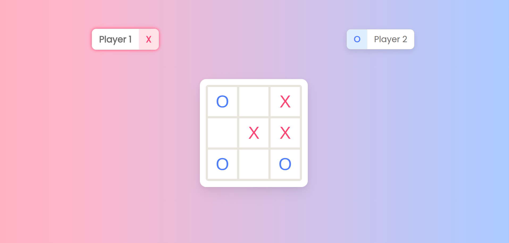

# 🎮 Tic-Tac-Toe

A modern, pastel-themed Tic-Tac-Toe game built with vanilla JavaScript using factory functions and module patterns (IIFE).

Live demo: [Tic-Tac-Toe](https://wolfieslab.github.io/Tic-Tac-Toe/)

---

## ✨ Features

- 🎨 Soft pastel UI design
- 👥 Custom player name input
- 🔄 Restart game functionality
- 🏠 Home button to return to start screen
- 🟢 Active player highlight with visual feedback
- 🏆 Win & Tie detection
- 💬 Modal-based start and end screens
- 🧠 Clean separation of logic and UI

---

## 🧩 Architecture

This project follows a modular pattern:

### 🟦 GameBoard (Factory Function)
- Manages board state
- Places marks
- Resets board

### 🟪 Player (Factory Function)
- Creates player objects with name and mark

### 🟨 GameController (IIFE Module)
- Controls game flow
- Handles turns
- Detects winner and tie
- Manages restart logic

### 🟩 ScreenController (IIFE Module)
- Handles DOM rendering
- Updates UI
- Controls dialogs
- Syncs game state with interface

---

## 🎨 UI Design

- Pastel red for **X**
- Pastel blue for **O**
- Floating card layout
- Subtle shadows and hover animations
- Gradient accents and blurred dialog backdrops

---

## 🚀 How to Run Locally

1. Clone the repository:

```bash
git clone https://github.com/your-username/tic-tac-toe.git
```

2. Open index.html in your browser. No build tools required.


## 🛠️ Technologies Used

- HTML5

- CSS3 (Flexbox + Grid)

- Vanilla JavaScript (ES6+)

- Factory Functions

- Module Pattern (IIFE)

- `<dialog>` element

## 📚 What I Learned

- Structuring JavaScript using modules

- Separating logic from UI

- Managing state without frameworks

- DOM manipulation and rendering cycles

- Designing cohesive UI systems

- Writing clean commit history

## 📌 Future Improvements

- 🎯 Highlight winning line

- 📱 Fully responsive layout

- 🔢 Score tracking system

- 🎵 Sound effects

- 🌙 Dark mode toggle

## 📷 Screenshot



## 👤 Author

Wolfie's Lab [GitHub Profile](https://github.com/wolfieslab)

---